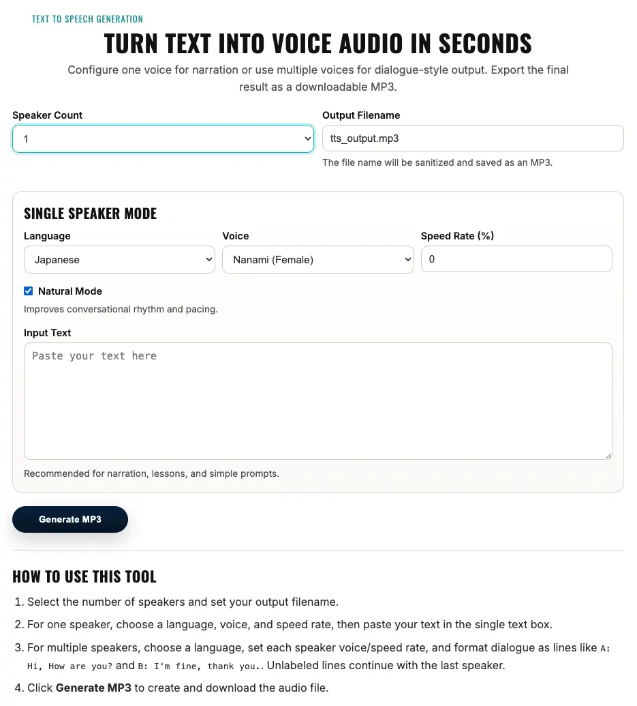

# Text to Speech App

[](https://github.com/gmskazi/text-to-speech/actions/workflows/ci.yml?query=branch%3Amain)

[](LICENSE)
[](https://fastapi.tiangolo.com/)
[](https://www.docker.com/)



This project started as a practical tool to make clean audio snippets for
Japanese teaching material my wife uses in class.

It grew into a small FastAPI app with both a browser UI and API endpoints, so
you can quickly turn text or short dialogues into MP3 files.

## Important Scope

- This app is currently for **internal/personal use only**.
- It is reliable for local classroom-content workflows, but it is not hardened
  as a public SaaS service.
- For production use, plan to replace `edge-tts` with a managed TTS backend,
  and add auth, rate limits, durable storage, and observability.

## What It Does

- Generate single-speaker MP3 from plain text
- Generate multi-speaker dialogue MP3 (A/B/C/D)
- Use language-specific voice lists (Japanese, English, Spanish, French,
  German, Korean, Chinese)
- Optionally normalize text in "natural mode"
- Support sync downloads and async job-based generation

## Tech Stack

- **Language:** Python 3.12+
- **Framework:** FastAPI + Jinja2 templates
- **TTS engine:** `edge-tts`
- **Audio merge:** `ffmpeg` (system binary)
- **Server:** `uvicorn`
- **Validation:** Pydantic
- **Quality tools:** Ruff, mypy, pytest, pip-audit
- **Container support:** Docker + Docker Compose

## Project Layout

```text
.
├── app/
│   ├── api/routes_tts.py        # REST endpoints
│   ├── services/
│   │   ├── tts_service.py       # TTS orchestration
│   │   ├── audio_merge.py       # ffmpeg concat logic
│   │   └── job_store.py         # in-memory async job store
│   ├── utils/
│   │   ├── text_utils.py        # dialogue parsing/normalization
│   │   └── file_utils.py        # output filename sanitization
│   ├── models/tts_models.py     # request/response models
│   ├── templates/index.html     # browser UI
│   └── main.py                  # app setup + web form route
├── tests/
│   ├── test_api.py
│   └── test_text_utils.py
├── scripts/
│   ├── build_local_image.sh
│   └── deploy_local.sh
├── Dockerfile
├── docker-compose.yml
├── Makefile
├── .mise.toml
└── pyproject.toml
```

## Prerequisites

- Docker + Docker Compose
- [mise](https://mise.jdx.dev/) (used to install Python and run project tasks)
- Claude Code or OpenCode (for Graphify skill workflow)
- `ffmpeg` is required only for non-Docker local runs (already included in
  the Docker image)

## Getting Started

### First-time setup check

Before running anything else, quickly confirm your tools are available:

```bash
mise --version
docker --version
docker compose version
```

Expected result: all three commands return a version string (and no errors).

If Docker is installed but the daemon is not running, `mise run check` still
runs the Python, lint, type, test, and dependency-audit checks and skips the
final local image build with a notice.

### Option A: Docker Compose + mise (recommended)

```bash
git clone https://github.com/gmskazi/text-to-speech.git
cd text-to-speech

# 1) Install toolchain/tasks from mise config
mise install

# 2) Build deploy-ready Docker image tags
mise run build-local-image

# 3) Start app with Docker Compose
docker compose up -d
```

Open:

- `http://localhost:8000/` (web UI)
- `http://localhost:8000/docs` (interactive API docs)
- `http://localhost:8000/health` (health check)

Stop the app:

```bash
docker compose down
```

### Option B: Local Python environment (no Docker)

```bash
git clone https://github.com/gmskazi/text-to-speech.git
cd text-to-speech

mise install
mise run run
```

## Knowledge Graph (Graphify)

This repository supports Graphify setup through `mise` only (no project
dependency added to `pyproject.toml`). This works for Claude Code and OpenCode
environments where you want graph-based repo navigation.

Install Graphify CLI + skill:

```bash
mise run graphify-install
```

Install OpenCode integration for this repository:

```bash
mise run graphify
```

Then run graph build inside OpenCode chat:

```text
/graphify .
```

Incrementally update graph after edits:

```bash
mise run graphify-update
```

Run a sample query:

```bash
mise run graphify-query
```

Optional: install post-commit hook to auto-refresh graph:

```bash
mise run graphify-hook-install
```

Notes:

- PyPI package is currently `graphifyy`, but command remains `graphify`.
- Output is written to `graphify-out/` (ignored by git).

## Using the Web App

1. Open `http://localhost:8000/`
2. Use the cinematic dark workspace to configure **Speaker Count** (`1` to `4`)
3. Set the output filename (the app enforces `.mp3` and sanitizes paths)
4. Use the main editor canvas for either narration text or multi-speaker dialogue
5. Tune language, voice, and speed in the narration or speaker mixer
6. In dialogue mode, add speaker sections and drag them to reorder playback
7. Click **Generate MP3**

Dialogue example:

```text
A: こんにちは。
B: はい、どうしましたか？
```

Tip: dialogue sections in the web UI are serialized into the existing `A:` / `B:`
prompt format before submission. Unlabeled lines still continue the previous
speaker in API usage.

## API Quick Reference

### Health

```bash
curl http://localhost:8000/health
```

### List voices for a language

```bash
curl "http://localhost:8000/tts/voices?language=ja-JP"
```

### Generate single-speaker audio

```bash
curl -X POST "http://localhost:8000/tts/single" \
  -H "Content-Type: application/json" \
  -d '{
    "text": "こんにちは、授業を始めます。",
    "voice": "ja-JP-NanamiNeural",
    "rate": -10,
    "output_name": "single.mp3",
    "natural_mode": true
  }' \
  --output single.mp3
```

### Generate dialogue audio

```bash
curl -X POST "http://localhost:8000/tts/dialogue" \
  -H "Content-Type: application/json" \
  -d '{
    "speaker_count": 2,
    "dialogue_text": "A: おはようございます。\nB: おはようございます。",
    "speakers": {
      "A": {"voice": "ja-JP-NanamiNeural", "rate": -5},
      "B": {"voice": "ja-JP-KeitaNeural", "rate": 0}
    },
    "output_name": "dialogue.mp3",
    "natural_mode": true
  }' \
  --output dialogue.mp3
```

### Async jobs (optional)

Create job:

```bash
curl -X POST "http://localhost:8000/tts/single/jobs" \
  -H "Content-Type: application/json" \
  -d '{
    "text": "こんにちは",
    "voice": "ja-JP-NanamiNeural",
    "rate": 0,
    "output_name": "job.mp3"
  }'
```

Check status:

```bash
curl "http://localhost:8000/jobs/<job_id>"
```

Download result:

```bash
curl -L "http://localhost:8000/jobs/<job_id>/download" --output result.mp3
```

## How It Works

- **Single mode:** text -> `edge-tts` -> MP3
- **Dialogue mode:** parse lines by speaker -> synthesize each line -> merge
  with `ffmpeg` concat
- **Natural mode:** light punctuation/spacing cleanup before TTS
- **Fallback behavior:** if TTS returns "no audio" in natural mode, app
  retries with original text

Dialogue parsing rules:

- Allowed labels are `A` to `D` (bounded by `speaker_count`)
- `:` and full-width `：` are accepted
- Empty lines are ignored
- First unlabeled line defaults to `A`

## Development Commands

- `mise run run`: start app (`uvicorn --reload`)
- `mise run check`: run compile, lint, type-check, tests, dependency audit,
  and Docker build smoke test
- `mise run check-docs`: lint docs and `README.md`
- `mise run graphify-install`: install Graphify tooling for Claude Code/OpenCode
- `mise run graphify`: install Graphify OpenCode repo integration
- `mise run graphify-update`: update graph from changed files only
- `mise run graphify-query`: run a sample graph query
- `mise run graphify-hook-install`: install git post-commit Graphify hook
- `make` or `make all`: run `check` and `check-docs`
- `make graphify`: install Graphify OpenCode repo integration via mise task
- `pytest -q`: run tests
- `ruff check .`: run linter
- `mypy app tests`: run static type checks

## Deployment

### Local Docker Compose deploy with health check + rollback

Build deploy image tags:

```bash
mise run build-local-image
```

Deploy current code (includes health check and rollback attempt on failure):

```bash
mise run deploy-local
```

Makefile wrappers are also available:

```bash
make build-local-image
make deploy-local
```

### Notes for production hosting

- App is container-friendly (`Dockerfile` + `docker-compose.yml`)
- Exposes port `8000`
- Requires `ffmpeg` in runtime image (already installed in Dockerfile)
- For public deployments, add auth/rate limiting and persistent storage for
  generated files/jobs

### Production TTS provider options (recommended instead of `edge-tts`)

- **Azure AI Speech**
  - Strong multilingual support, low latency, robust SSML controls, enterprise SLAs.
  - Best fit if you want close voice/language coverage to your current setup.
- **Amazon Polly**
  - Stable and cost-effective for high volume; easy AWS integration.
  - Good choice if you already run infrastructure on AWS.
- **Google Cloud Text-to-Speech**
  - Natural voices and broad language support.
  - Good fit for teams already using GCP services.
- **ElevenLabs**
  - Very natural expressive voices and voice cloning features.
  - Useful for high-quality educational narration and character voices.
- **OpenAI TTS / Realtime audio models**
  - Good developer UX and easy API integration for modern AI stacks.
  - Good option if you are already building around OpenAI APIs.

Implementation note: the clean swap point is `app/services/tts_service.py`
(`_save_with_voice_fallback`, `generate_single_speaker`, and
`generate_dialogue_parts`).

## Troubleshooting

### `ffmpeg is not installed or not in PATH`

Install `ffmpeg` locally or run via Docker image that already includes it.

### `No audio was received`

Try simpler text with letters/numbers (not punctuation only), or switch
voice/language. In natural mode, the app already retries once with original
text.

### Job download says result not ready

The async endpoint is eventually consistent. Poll `/jobs/{job_id}` until
status is `done`, then download.

### Jobs disappear after restart

Expected currently: async jobs are stored in memory
(`app/services/job_store.py`) and are not persistent.

## Current Limitations

- Async jobs are in-memory only (not durable)
- No built-in auth/rate limiting for internet-facing API usage
- Generated files are temporary and cleaned up after download

## License

MIT. See `LICENSE`.
